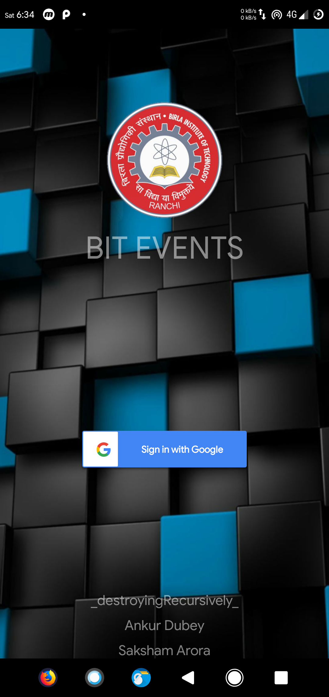
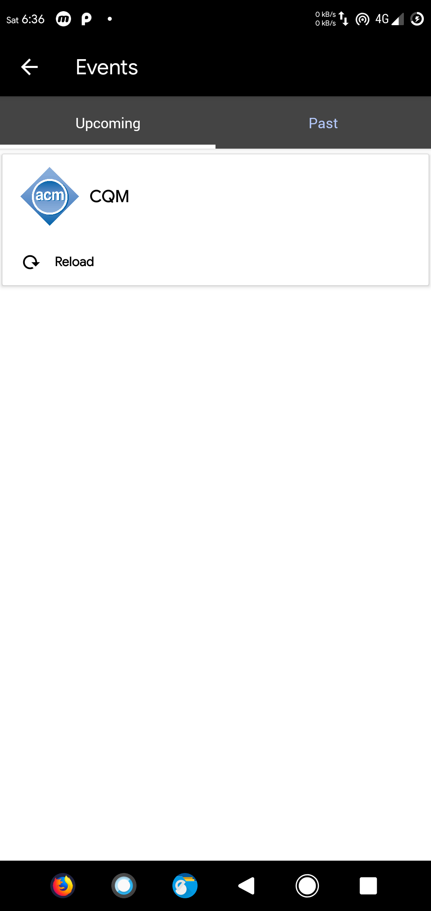
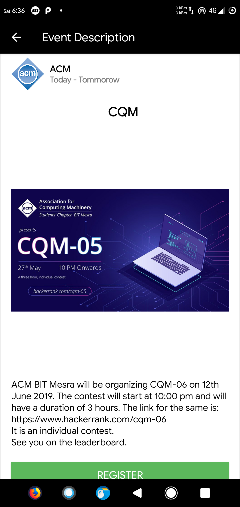

# BIT EVENTS #

BIT Events is an app which tracks all the events happening in BIT Mesra campus. The main purpose of the app is notify everyone about the events and simultaneously providing them the platform to check and register in the event. The app begins with the login page, the login functionality uses Google Sign In to sign into the app. There will be two kind of accounts clubs Admin and normal users. The Club Admin will have option to create new events. All the events are synced to firebase database so any information related to the events will be retreived from it. After the login screen we have a home screen. Our home screen will have two tabs Upcoming Events and past Events. When you click on the event it opens a new screen displaying about the event details. There will be a register button to register for the event whenever it is pressed you are registered for the event as well as if there is any google form provided by the club it will be displayed asking your details about the event.

# Screenshots 

| Login      | Home      |Description    |
|------------|-------------|-------------| 
 |  | 
